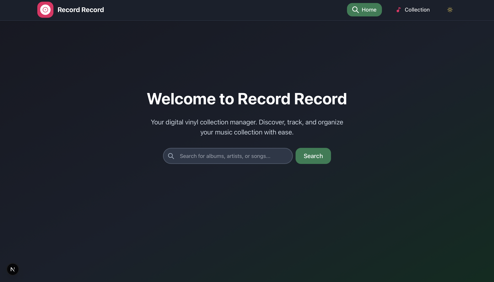
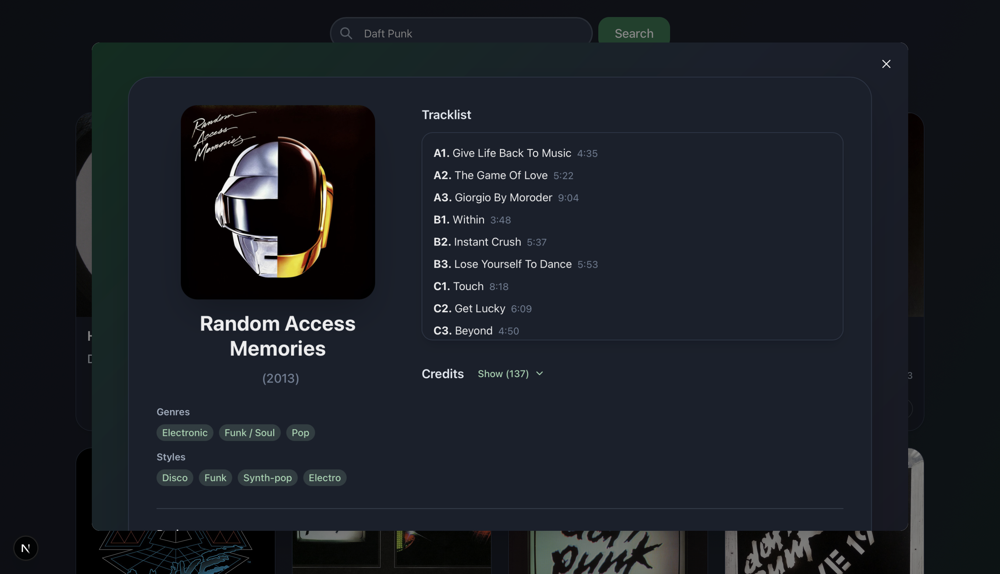
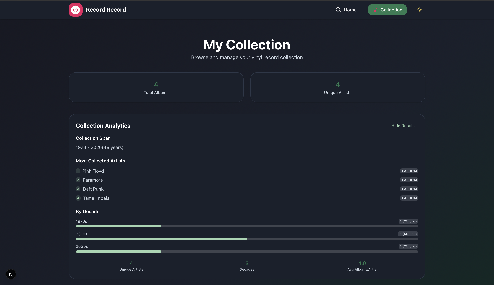

# Record Record 🎵

[](https://nextjs.org/)
[](https://reactjs.org/)
[](https://www.typescriptlang.org/)
[](https://chakra-ui.com/)
[](https://opensource.org/licenses/MIT)

A modern, responsive web application for managing your vinyl record collection. Built with Next.js 15 and integrated with the Discogs API, Record Record provides a beautiful interface to search, discover, and organize your music collection.

> **Note**: This project was developed as a learning exercise to explore modern React development and AI-assisted coding workflows.

## ✨ Features

- 🔍 **Comprehensive Search**: Search through Discogs' vast database of music releases
- 📀 **Collection Management**: Add and remove albums from your personal collection
- � **Collection Analytics**: View statistics and insights about your collection
- 📝 **Detailed Album Info**: Access tracklists, credits, reviews, and community ratings
- 🎨 **Modern UI**: Clean, responsive design with smooth animations
- 📱 **Mobile Friendly**: Fully responsive across all device sizes
- ⚡ **Fast Performance**: Optimized with Next.js 15 App Router and React 19
- 🔒 **Secure**: Environment-based configuration with proper API key handling

## � Screenshots

### Home Page & Search


_Search through Discogs vast database with a clean interface_

### Search Results


_Browse through search results with album artwork and quick collection management_

### Album Details


_Detailed album information including tracklist, credits, and community reviews_

### COllection Stats View


_See analytics and insights on your collection_

### Collection View


_Manage your personal collection_

## �🚀 Quick Start

### Prerequisites

- **Node.js** 18+ and npm
- **Discogs API credentials** (free - see [setup guide](#getting-discogs-api-credentials))

### Installation

1. **Clone the repository:**

   ```bash
   git clone https://github.com/Noahdp/record-record.git
   cd record-record
   ```

2. **Install dependencies:**

   ```bash
   npm install
   ```

3. **Set up environment variables:**

   ```bash
   cp .env.example .env.local
   ```

   Edit `.env.local` and add your Discogs API credentials:

   ```env
   DISCOGS_CONSUMER_KEY=your_consumer_key_here
   DISCOGS_CONSUMER_SECRET=your_consumer_secret_here
   ```

4. **Set up the database:**

   ```bash
   npx prisma generate
   npx prisma db push
   ```

5. **Start the development server:**

   ```bash
   npm run dev
   ```

6. **Open your browser:**
   Navigate to [http://localhost:3000](http://localhost:3000)

### Getting Discogs API Credentials

1. **Create a Discogs account** at [discogs.com](https://www.discogs.com)
2. **Go to Developer Settings**: [discogs.com/settings/developers](https://www.discogs.com/settings/developers)
3. **Create a new application:**
   - Name: "Record Record" (or your preferred name)
   - Description: "Personal vinyl collection manager"
   - Website: Your deployment URL (or localhost for development)
4. **Copy your credentials** to `.env.local`

> **Note**: Discogs API is free for personal use with generous rate limits.

## 🛠️ Tech Stack

- **Framework**: [Next.js 15.3.2](https://nextjs.org/) with App Router
- **Frontend**: [React 19.0.0](https://reactjs.org/) with TypeScript 5
- **UI Library**: [Chakra UI 2.8.2](https://chakra-ui.com/) with [Framer Motion 12.12.1](https://www.framer.com/motion/)
- **Database**: SQLite with [Prisma 6.8.2](https://prisma.io/) ORM
- **API Integration**: [Discogs API](https://www.discogs.com/developers/) via [disconnect 1.2.2](https://github.com/bartve/disconnect)
- **Styling**: Tailwind CSS 3.3.2 + Chakra UI theming
- **Development**: ESLint 9, TypeScript, Hot Reload

## 📁 Project Structure

```
record-record/
├── src/
│   ├── app/                    # Next.js 15 App Router
│   │   ├── api/               # API routes (Discogs & Collection)
│   │   ├── collection/        # Collection management pages
│   │   ├── globals.css        # Global styles
│   │   ├── layout.tsx         # Root layout
│   │   └── page.tsx           # Home page
│   ├── components/            # Reusable React components
│   │   ├── AlbumCard.tsx     # Album display cards
│   │   ├── AlbumGrid.tsx     # Grid layouts
│   │   ├── NavBar.tsx        # Navigation
│   │   ├── SearchInput.tsx   # Search functionality
│   │   └── ...               # 20+ components
│   ├── hooks/                # Custom React hooks
│   │   ├── useSearch.ts      # Search functionality
│   │   ├── useCollection.ts  # Collection management
│   │   └── ...               # 7 specialized hooks
│   ├── lib/                  # Utility libraries
│   │   ├── api/              # API client functions
│   │   ├── config/           # Environment configuration
│   │   ├── db/               # Database connection
│   │   └── errors/           # Error handling
│   ├── types/                # TypeScript definitions
│   │   ├── Album.ts          # Core album types
│   │   ├── AlbumDetail.ts    # Detailed album info
│   │   └── ...               # 7 type files
│   └── utils/                # Helper functions
│       ├── animationUtils.ts # Framer Motion configs
│       ├── ratingUtils.ts    # Rating calculations
│       └── ...               # 5 utility files
├── prisma/
│   ├── schema.prisma         # Database schema
│   └── migrations/           # Database migrations
├── public/                   # Static assets
├── .env.example             # Environment template
├── next.config.ts           # Next.js configuration
├── tailwind.config.ts       # Tailwind configuration
└── tsconfig.json            # TypeScript configuration
```

## 🔌 API Endpoints

### Discogs Integration

- `GET /api/discogs/search?q={query}` - Search albums in Discogs database
- `GET /api/discogs/{id}` - Get detailed album information
- `GET /api/discogs/{id}/reviews` - Get community reviews and ratings

### Collection Management

- `GET /api/collection/all` - Retrieve user's complete collection
- `GET /api/collection/{id}` - Check if album is in collection
- `POST /api/collection/all` - Add album to collection
- `DELETE /api/collection/{id}` - Remove album from collection

## 🎨 Key Components

### Core Components

- **`AlbumCard`**: Interactive album display with collection management
- **`AlbumDetailCard`**: Comprehensive album information view
- **`SearchInput`**: Debounced search with loading states
- **`ResultsDisplay`**: Responsive grid layout for search results
- **`CollectionStats`**: Analytics and collection insights

### Specialized Components

- **`ReviewSection`**: Community ratings and individual reviews
- **`Tracklist`**: Formatted track listings with credits
- **`Credits`**: Artist and production credit display
- **`VinylSpinner`**: Custom loading animation
- **`OptimizedImage`**: Responsive image component with loading states

## 🚀 Deployment

### Vercel (Recommended)

[](https://vercel.com/new/clone?repository-url=https://github.com/Noahdp/record-record)

1. **Connect your GitHub repository** to Vercel
2. **Add environment variables** in Vercel dashboard:
   - `DISCOGS_CONSUMER_KEY`
   - `DISCOGS_CONSUMER_SECRET`
   - `DATABASE_URL` (optional - defaults to SQLite)
3. **Deploy automatically** on git push

### Manual Deployment

1. **Build the application:**

   ```bash
   npm run build
   ```

2. **Start production server:**
   ```bash
   npm run start
   ```

### Environment Variables

Required for production:

```env
DISCOGS_CONSUMER_KEY=your_consumer_key
DISCOGS_CONSUMER_SECRET=your_consumer_secret
DATABASE_URL=your_database_url  # Optional: defaults to SQLite
NODE_ENV=production
```

### Development Setup

1. **Fork the repository** on GitHub
2. **Clone your fork:**
   ```bash
   git clone https://github.com/YOUR_USERNAME/record-record.git
   cd record-record
   ```
3. **Follow installation steps** above
4. **Create a feature branch:**
   ```bash
   git checkout -b feature/your-feature-name
   ```

### Development Guidelines

- **Code Style**: Follow existing TypeScript and React conventions
- **Components**: Use Chakra UI components and maintain responsive design
- **Types**: Add TypeScript types for all new functions and components
- **Testing**: Test changes thoroughly across different screen sizes
- **Documentation**: Update README and code comments for significant changes

### Submitting Changes

1. **Commit your changes:**
   ```bash
   git commit -m "feat: add your feature description"
   ```
2. **Push to your fork:**
   ```bash
   git push origin feature/your-feature-name
   ```
3. **Create a Pull Request** with a clear description of changes

### Development Commands

```bash
npm run dev        # Start development server
npm run build      # Build for production
npm run start      # Start production server
npm run lint       # Run ESLint
npx prisma studio  # Open database browser
npx prisma generate # Regenerate Prisma client
```

## 🔧 Configuration

### Environment Variables

| Variable                  | Required | Description                 | Default                |
| ------------------------- | -------- | --------------------------- | ---------------------- |
| `DISCOGS_CONSUMER_KEY`    | Yes      | Discogs API consumer key    | -                      |
| `DISCOGS_CONSUMER_SECRET` | Yes      | Discogs API consumer secret | -                      |
| `DATABASE_URL`            | No       | Database connection string  | `file:./prisma/dev.db` |
| `NODE_ENV`                | No       | Environment mode            | `development`          |

### Customization

#### Database

Switch from SQLite to PostgreSQL by updating `prisma/schema.prisma`:

```prisma
datasource db {
  provider = "postgresql"
  url      = env("DATABASE_URL")
}
```

## 📝 License

This project is licensed under the **MIT License** - see the [LICENSE](LICENSE) file for details.

## 🙏 Acknowledgments

- **[Discogs](https://www.discogs.com/)** - Comprehensive music database and API
- **[Next.js Team](https://nextjs.org/)** - Amazing React framework and developer experience
- **[Chakra UI](https://chakra-ui.com/)** - Beautiful, accessible component library
- **[Prisma](https://prisma.io/)** - Type-safe database toolkit
- **[Vercel](https://vercel.com/)** - Seamless deployment platform

## 💬 Support

- **🐛 Bug Reports**: [Open an issue](https://github.com/Noahdp/record-record/issues)
- **⭐ Show Support**: Give this project a star if you find it useful!

## 📊 Project Stats

- **Components**: 22 reusable React components
- **Hooks**: 7 custom hooks for state management
- **Type Definitions**: 7 TypeScript interfaces and types
- **API Routes**: 6 Next.js API endpoints
- **Database Tables**: Album collection with Prisma ORM

---

<div align="center">

**Built using Next.js 15, React 19, and TypeScript**

[⭐ Star this repo](https://github.com/Noahdp/record-record) • [🐛 Report Bug](https://github.com/Noahdp/record-record/issues)

</div>
